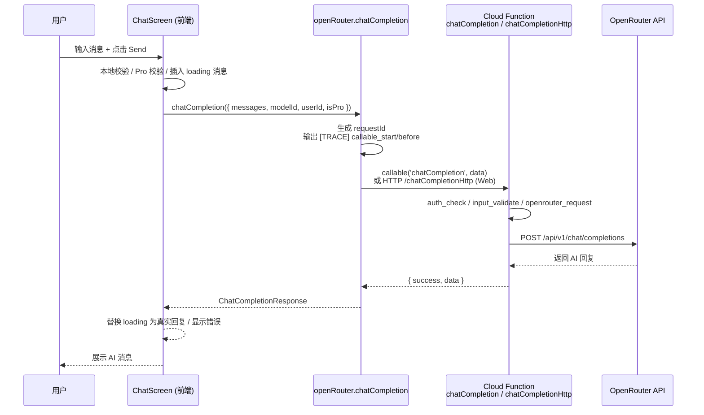

# GemGPT · AI 聚合器 Mobile/Web

[](./app.json)
[](./functions/package.json)
[](./tsconfig.json)
[](./vite.config.ts)
[](./app.json)
[](#license)

GemGPT 是一个 **多模型（OpenAI / Google / DeepSeek / 等）聚合的 AI 助手**，提供聊天、图片生成、PDF 阅读分析等能力。  
前端同时支持 **Web（Vite + React）** 与 **移动端（Expo / React Native）**，后端通过 **Firebase Cloud Functions + OpenRouter API** 统一调用模型。

> 设计来源：[Figma · AI聚合器Mobile](https://www.figma.com/design/TjUYc3sDb25JeRsGxaf5nl/AI%E8%81%9A%E5%90%88%E5%99%A8Mobile)

---

## 功能特性

- **多模型聊天（Chat）**：支持 DeepSeek / GPT / Gemini / Perplexity / Grok 等模型，一键切换。
- **图片生成（Image Generation）**：文字描述 + 可选参考图，生成图片（通过 OpenRouter + FLUX 模型）。
- **PDF 阅读分析（PDF Reading）**：上传 PDF，提问或追问，支持多轮问答，同一 PDF 不重复上传。
- **多场景入口**：普通聊天、AI Art、角色聊天（Role Chat）、助手列表、历史记录等。
- **Pro 订阅能力**：前端 + 后端双重 Pro 校验（Image / PDF 为 Pro-only），配合 `ProPaywall` 与支付成功页。
- **统一观测性（Observability）**：
  - 前端：`[TRACE] feature=<chat|image|pdf> step=<validate|upload|callable|render>` 日志。
  - 后端：`functions.logger.info/error` 结构化日志（`requestId / uid / feature / step / modelId / ...`）。

---

## 快速开始（Quick Start）

### 1. 安装依赖

```bash
npm install
```

### 2. 配置 Firebase & OpenRouter

1. 复制并填写环境变量示例：

   ```bash
   cp .env.example .env      # 前端/Expo 不直接用 .env，但可作为备份记录
   ```

2. 确认 `app.json` 中的 `extra.VITE_FIREBASE_*` 已配置为你的 Firebase 项目（当前已指向 `gemgpt-ai-assistance`）。

3. 配置 Functions 端 OpenRouter Key（在 `functions/` 目录）：

   ```bash
   cd functions
   cp src/config.example.ts src/config.ts
   # 然后在 src/config.ts 中填入你的 OPENROUTER_API_KEY
   ```

   或者使用 Firebase Functions Config（推荐生产环境）：

   ```bash
   firebase functions:config:set openrouter.apikey="YOUR_OPENROUTER_API_KEY"
   ```

### 3. 启动 Web 开发环境（Vite）

```bash
npm run dev
# 默认打开 http://localhost:3000 或 3001
```

### 4. 启动 Expo（移动端，可选）

```bash
# 启动 Expo（自动选择平台）
npm run expo:start

# 或指定平台
npm run expo:ios
npm run expo:android
npm run expo:web
```

> 详细的 Expo/真机调试说明见：[README_EXPO](./README_EXPO.md)、[EXPO_TESTING_GUIDE.md](./EXPO_TESTING_GUIDE.md)、[真机测试指南.md](./真机测试指南.md)

---

## 目录结构（你该从哪里读代码）

```text
.
├─ package.json                 # 前端 / Web / Expo 入口脚本
├─ app.json                     # Expo 配置 + Firebase Web 配置
├─ README.md                    # 本文件
├─ src/
│  ├─ main.tsx                  # Web 入口（挂载 React App）
│  ├─ App.tsx                   # 应用根组件 / 路由与布局
│  ├─ config/
│  │  ├─ firebase.ts            # Firebase 初始化 (Auth/Firestore/Storage/Functions)
│  │  └─ firebaseConfig.ts      # Firebase Web 配置（从 app.json.extra 派生）
│  ├─ services/
│  │  ├─ openRouter.ts          # 前端调用 Cloud Functions 的封装
│  │  └─ storageUpload.ts      # 上传文件到 Firebase Storage
│  ├─ components/
│  │  ├─ ChatScreen.tsx         # 主聊天界面（Chat / PDF / Image 等入口）
│  │  ├─ ImageGenerationModal.tsx# 图片生成弹窗
│  │  ├─ PDFReadingModal.tsx   # PDF 阅读弹窗
│  │  ├─ ProPaywall.tsx        # Pro 支付弹窗
│  │  ├─ PaymentSuccess.tsx     # 支付成功页
│  │  ├─ ...                    # 其它 UI 组件（Assistants / History / Settings 等）
│  │  └─ ui/                    # 通用 UI 组件库（Button / Dialog / Tabs 等）
│  ├─ utils/
│  │  ├─ translations.ts       # 文案/多语言（目前主要是英文）
│  │  └─ user.ts               # 获取当前用户 ID / Pro 状态辅助函数
│  └─ styles/
│     └─ globals.css           # 全局样式
│
├─ functions/
│  ├─ package.json              # Functions 依赖和脚本
│  ├─ src/
│  │  ├─ index.ts               # 导出 Cloud Functions 入口
│  │  ├─ chat.ts                # chatCompletion / chatCompletionHttp
│  │  ├─ imageGeneration.ts     # generateImage
│  │  ├─ pdfReading.ts          # analyzePDF
│  │  ├─ config.example.ts      # OpenRouter API Key 示例
│  │  └─ config.ts              # OpenRouter API Key（本地创建，已 .gitignore）
│  └─ ...                       # 编译输出 (lib/)、tsconfig 等
│
├─ firebase.json                # Firebase Hosting / Functions / Firestore 配置
├─ .env.example                 # 前端相关环境变量示例
├─ proxy.env.example            # Git 代理示例（与运行时无关）
└─ 文档（*.md）                  # 部署 / 测试 / 问题排查指南
```

**阅读顺序推荐（Reading Guide）：**

1. `src/main.tsx` → 了解 Web 入口如何挂载 `App`.
2. `src/App.tsx` → 看屏幕切换、Tab、弹窗、认证初始化。
3. `src/components/ChatScreen.tsx` → 主聊天 UI 与 Chat/Image/PDF 入口。
4. `src/services/openRouter.ts` → 前端如何调用 Cloud Functions / 处理错误。
5. `functions/src/index.ts` & `functions/src/*.ts` → 后端 Functions 如何转发到 OpenRouter。
6. `src/services/storageUpload.ts` & `PDFReadingModal.tsx` / `ImageGenerationModal.tsx` → 文件上传 + 调用链路。

---

## 核心架构（模块关系图）

```mermaid
flowchart LR
  U[用户<br/>Web / 手机] --> UI[前端 UI<br/>Vite + React / Expo]
  UI --> Auth[Firebase Auth<br/>匿名登录]
  UI --> CF[Cloud Functions<br/>chatCompletion / generateImage / analyzePDF]
  UI --> Storage[Firebase Storage<br/>上传图片 / PDF]

  CF --> OR[OpenRouter API<br/>/chat/completions<br/>/images/...]
  CF --> Logs[Functions Logger<br/>(requestId / uid / step)]

  style U fill:#fff,stroke:#333
  style UI fill:#f5f5f7,stroke:#555
  style CF fill:#e8f4ff,stroke:#336
  style OR fill:#ffe8f0,stroke:#833
  style Storage fill:#e8ffe8,stroke:#383
  style Auth fill:#e8e8ff,stroke:#44f
```

---

## 关键链路（以 Chat 为例的时序图）



同理，Image / PDF 链路只是多了 **Storage 上传** 与不同的 Cloud Function：

- Image：`ImageGenerationModal` → `storageUpload.uploadFileToStorage` → `openRouter.generateImage` → `functions/src/imageGeneration.ts`.
- PDF：`PDFReadingModal` → `storageUpload.uploadFileToStorage` → `openRouter.analyzePDF` → `functions/src/pdfReading.ts`.

---

## 功能实现路径索引（Feature → 文件路径 → 调用链路）

### Chat 聊天

- **前端入口**：[`src/components/ChatScreen.tsx`](./src/components/ChatScreen.tsx)
  - 用户输入 + 点击 Send → `handleSend`
  - 生成 `requestId` 并输出 `[TRACE] feature=chat step=validate/callable/render`
- **前端 Service**：[`src/services/openRouter.ts`](./src/services/openRouter.ts)
  - `chatCompletion(request: ChatCompletionRequest)`
  - Web 环境使用 `chatCompletionHttp`（绕过 CORS），Native 使用 `httpsCallable(functions, 'chatCompletion')`
- **后端 Function**：[`functions/src/chat.ts`](./functions/src/chat.ts)
  - `export const chatCompletion = functions.https.onCall(...)`
  - `export const chatCompletionHttp = functions.https.onRequest(...)`
  - 调用 OpenRouter `/api/v1/chat/completions`

### Image Generation（图片生成）

- **前端入口**：[`src/components/ImageGenerationModal.tsx`](./src/components/ImageGenerationModal.tsx)
  - `handleGenerate`：校验 → Pro 权限 → 上传参考图 → 调用 Service → 展示图片
- **上传逻辑**：[`src/services/storageUpload.ts`](./src/services/storageUpload.ts)
  - `uploadFileToStorage({ file, path })` → 返回 `downloadURL`
- **前端 Service**：[`src/services/openRouter.ts`](./src/services/openRouter.ts)
  - `generateImage(request: ImageGenerationRequest)` → `httpsCallable(functions, 'generateImage')`
- **后端 Function**：[`functions/src/imageGeneration.ts`](./functions/src/imageGeneration.ts)
  - `generateImage`：校验 prompt / Pro 权限 → OpenRouter `/api/v1/chat/completions`（FLUX 文生图）→ 返回 `imageUrl`

### PDF Reading（PDF 阅读分析）

- **前端入口**：[`src/components/PDFReadingModal.tsx`](./src/components/PDFReadingModal.tsx)
  - `handleAnalyze`：校验文件 + 问题 → Pro 权限 → 上传（或复用 URL）→ 调用 Service → 展示 Answer
- **上传逻辑**：同 `uploadFileToStorage`，路径 `pdfs/...`
- **前端 Service**：[`src/services/openRouter.ts`](./src/services/openRouter.ts)
  - `analyzePDF(request: AnalyzePDFRequest)` → `httpsCallable(functions, 'analyzePDF')`
- **后端 Function**：[`functions/src/pdfReading.ts`](./functions/src/pdfReading.ts)
  - `analyzePDF`：校验 URL / question / Pro 权限 → OpenRouter `/api/v1/chat/completions`（MiMo-V2-Flash 多模态）→ 返回 answer

### 认证与 Pro 权限

- **匿名登录与状态管理**：[`src/App.tsx`](./src/App.tsx)
  - `useEffect` 中 `onAuthStateChanged + signInAnonymously(auth)` → 保证 `context.auth` 存在
  - `isPro` 状态控制 Pro 功能入口 & `ProPaywall`
- **Firebase 初始化**：[`src/config/firebase.ts`](./src/config/firebase.ts)
  - 统一导出：`auth`, `db`, `storage`, `functions(app, 'us-central1')`
- **用户辅助函数**：[`src/utils/user.ts`](./src/utils/user.ts)
  - `getCurrentUserId()`：返回当前 `auth.currentUser.uid`（或抛错）

### UI 与其它功能（简要）

- **Assistants & 历史**：[`src/components/AssistantsScreen.tsx`](./src/components/AssistantsScreen.tsx), [`src/components/HistoryScreen.tsx`](./src/components/HistoryScreen.tsx)
- **支付/Pro**：[`src/components/ProPaywall.tsx`](./src/components/ProPaywall.tsx), [`src/components/PaymentSuccess.tsx`](./src/components/PaymentSuccess.tsx)
- **角色聊天 / Art**：[`src/components/AIRoleChatScreen.tsx`](./src/components/AIRoleChatScreen.tsx), [`src/components/ArtGeneratorScreen.tsx`](./src/components/ArtGeneratorScreen.tsx), [`src/components/ArtChatScreen.tsx`](./src/components/ArtChatScreen.tsx)
- **全局错误边界**：[`src/components/ErrorBoundary.tsx`](./src/components/ErrorBoundary.tsx)

---

## 配置项与环境变量

> **注意**：不要把真实密钥提交到 Git，Functions 的 `config.ts` 已在 `.gitignore` 中。

### 前端 / Expo 相关（Firebase Web）

| 变量名                       | 用途                            | 示例                                       | 必填 | 读取位置                                           |
|----------------------------|---------------------------------|--------------------------------------------|------|----------------------------------------------------|
| `VITE_FIREBASE_API_KEY`    | Firebase Web API Key            | `AIza...`                                  | 是   | `app.json.extra` / [`src/config/firebaseConfig.ts`](./src/config/firebaseConfig.ts) |
| `VITE_FIREBASE_AUTH_DOMAIN`| Firebase Auth 域名              | `xxx.firebaseapp.com`                      | 是   | 同上                                              |
| `VITE_FIREBASE_PROJECT_ID` | Firebase 项目 ID                | `gemgpt-ai-assistance`                     | 是   | 同上                                              |
| `VITE_FIREBASE_STORAGE_BUCKET` | Storage Bucket                 | `xxx.firebasestorage.app`                  | 是   | 同上                                              |
| `VITE_FIREBASE_MESSAGING_SENDER_ID` | Sender ID                 | `397459517247`                             | 是   | 同上                                              |
| `VITE_FIREBASE_APP_ID`     | Web App ID                      | `1:xxx:web:xxx`                            | 是   | 同上                                              |

这些变量在当前仓库里已经硬编码在 [`app.json`](./app.json) 的 `expo.extra` 中，Web/Expo 运行时直接从这里读取。

### Functions / OpenRouter 相关

| 变量名 / 配置                 | 用途                          | 示例                          | 必填 | 读取位置                                    |
|------------------------------|-------------------------------|-------------------------------|------|---------------------------------------------|
| `OPENROUTER_API_KEY`         | OpenRouter API 密钥           | `sk-or-v1-...`                | 是   | [`functions/src/config.ts`](./functions/src/config.example.ts) |
| `functions:config.openrouter.apikey` | Functions 运行时配置（推荐） | 见下方 `firebase functions:config:set` | 否（与上二选一） | [`functions/src/config.ts`] 或 `process.env`（按你的实现） |

配置命令示例：

```bash
cd functions
firebase functions:config:set openrouter.apikey="YOUR_OPENROUTER_API_KEY"
```

---

## 本地开发与联调

### 启动前端（Web）

```bash
npm install
npm run dev
# 打开浏览器 http://localhost:3000 （或终端提示的端口）
```

前端调试要点：

- 打开浏览器 DevTools Console，关注 `[TRACE] feature=... step=...` 日志。
- 对 Chat / Image / PDF 分别验证以下步骤均出现：
  - `step=validate`
  - （有上传时）`step=upload` / `upload_complete`
  - `step=callable_start` / `callable_before` / `callable_after`
  - `step=render` 或错误提示

### 启动 Firebase Functions（本地 Emulator，可选）

> 如果你只验证“端到端真实调用线上 Firebase 项目”，可以直接部署到线上 Functions 并通过 Web 调用。  
> 若想本地 Emulator 联调，请参考：[`TESTING_SETUP.md`](./TESTING_SETUP.md)、[`EXPO_TESTING_GUIDE.md`](./EXPO_TESTING_GUIDE.md)。

简略步骤示例：

```bash
cd functions
npm install
npm run build
firebase emulators:start --only functions,firestore,storage,auth
```

然后在 `src/config/firebase.ts` 中（开发阶段）连接 Emulator（如需要）。

### 部署 Functions 到线上（GitHub Actions 或本机）

- 文档参考：
  - [`DEPLOY_FUNCTIONS.md`](./DEPLOY_FUNCTIONS.md)
  - [`RUN_DEPLOY_NOW.md`](./RUN_DEPLOY_NOW.md)
  - [`DEPLOY_VIA_GITHUB_ACTIONS.md`](./DEPLOY_VIA_GITHUB_ACTIONS.md)

---

### 联调检查清单（Checklist）

**Chat：**

- [ ] 页面加载后 Console 有 "✅ 匿名登录成功" 日志。
- [ ] 输入消息并点击 Send：
  - [ ] Console 出现 `[TRACE] feature=chat step=validate`。
  - [ ] 随后出现 `step=callable_start` → `step=callable_after`。
  - [ ] Functions 日志中能看到 `[chatCompletion] step=openrouter_request/response`。
  - [ ] 页面显示 AI 回复；若出错，错误卡片中展示具体信息。

**Image：**

- [ ] 打开 Image Generation 弹窗（🎨）。
- [ ] 输入描述并点击 Generate：
  - [ ] 非 Pro 用户：直接弹出 ProPaywall（不触发 Functions）。
  - [ ] Pro 用户：Console 有 `feature=image step=validate/callable`，Functions 有 `[generateImage]` 日志。
  - [ ] 如果上传参考图：Console 有 `feature=image step=upload/upload_complete`。
  - [ ] 最终页面展示生成图片 URL。

**PDF：**

- [ ] 打开 PDF Reading 弹窗（📄）。
- [ ] 上传小于 10MB 的 PDF，输入问题并点击 Analyze：
  - [ ] Console 有 `[TRACE] feature=pdf step=validate/upload/callable`。
  - [ ] Functions 日志有 `[analyzePDF] step=openrouter_request/response`。
  - [ ] 页面展示 Answer。
- [ ] 对同一 PDF 再提问：
  - [ ] Console 有 `step=reuse_upload`（无重新 upload）。
  - [ ] Functions 被再次调用，Answer 更新。

---

### 常见问题排查（FAQ）

**Q1. 前端 Console 报 `unauthenticated` / Functions 返回 `unauthenticated`？**  
- 确认 `onAuthStateChanged + signInAnonymously(auth)` 正常执行（看 Console：`✅ 匿名登录成功`）。
- 检查 Firebase Console 中是否已 **启用匿名登录**。

**Q2. Functions 返回 `permission-denied`？**  
- Image/PDF 功能需要 Pro 权限：
  - 前端 `isPro` 状态是否为 true？
  - 后端 `imageGeneration.ts` / `pdfReading.ts` 中会再次校验 `isPro`，确保请求中传入。

**Q3. CORS / Preflight 报错？**  
- Web 端 Chat 默认走 `chatCompletionHttp` HTTP 端点 + CORS 处理。
- 确认 Cloud Functions 已成功部署，且 `REGION` 与 `firebaseConfig.projectId` 配置一致。

**Q4. OpenRouter 报 401 / 429 / 内部错误？**  
- 401：确认 `OPENROUTER_API_KEY` 有权限、未过期。
- 429：达到配额/限流，稍后重试或降低调用频率。
- 其它错误：查看 Functions 日志中的 `errorStatus` / `errorMessage` 字段。

---

## 贡献方式 / Roadmap（简要）

- **短期计划：**
  - [ ] 在 Functions 端接入真实用户 Pro 订阅状态（Firestore）。
  - [ ] 丰富 Assistants 模块（多轮记忆、工具调用等）。
- **贡献方式：**
  - Fork 本仓库，创建分支进行修改。
  - 提交 PR 时，请在描述中附上：
    - 改动范围
    - 本地测试步骤
    - 相关日志截图（若为 Bugfix）

---

## License

本项目遵循 MIT License。你可以自由使用、修改和分发本项目代码，但请在分发时保留原始 License 声明。
